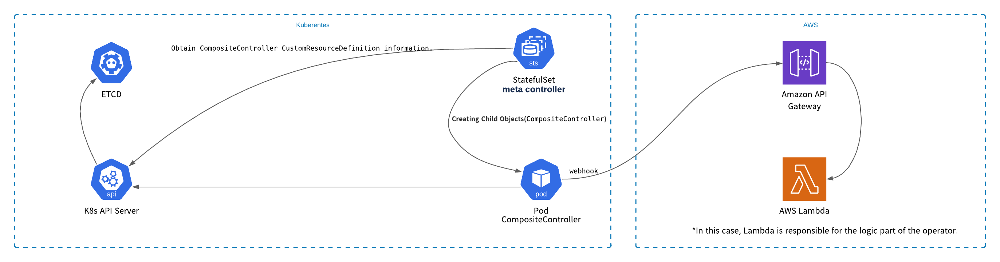
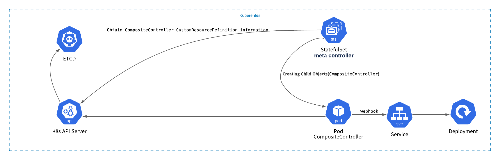

# README

## introduction

## What application is this?

TUB

## meta controller architecture

### Example of implementing a controller in AWS

### Example of implementing a controller in Kubernetes cluster

## test application architecture

TUB